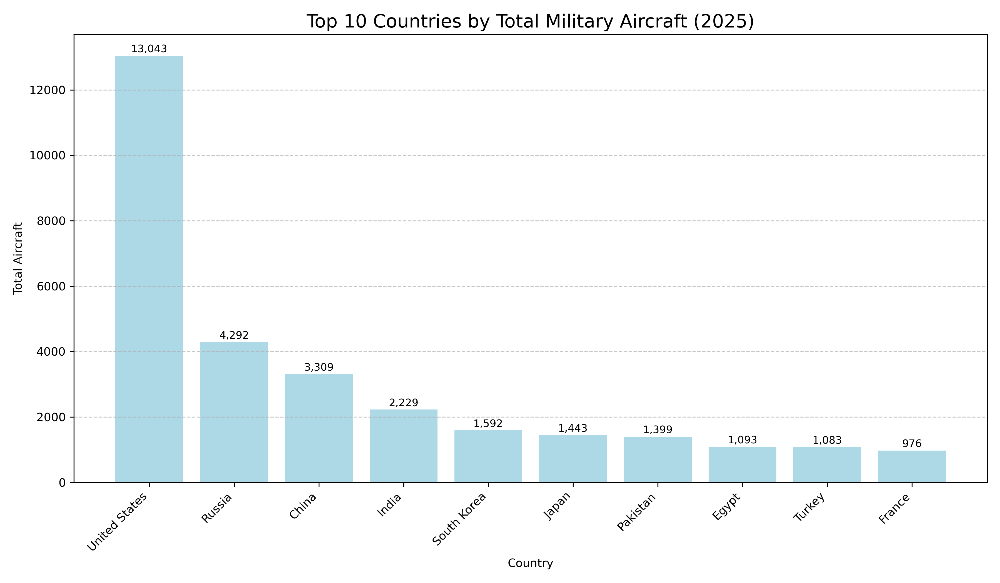

# ✈️ Military Airpower 2025

This project visualizes the top 10 countries with the largest military aircraft fleets in 2025 using data from Global Firepower.

## 📊 Contents

- Bar chart
- Pie chart
- Tabular heatmap
- Clean summary table
- Interactive Plotly HTML chart

## 🧰 Tools
- Python
- pandas, matplotlib, seaborn, plotly, geopandas

## 📎 Source
[Global Firepower – Total Aircraft (2025)](https://www.globalfirepower.com/aircraft-total.php)

## 🌐 Preview

